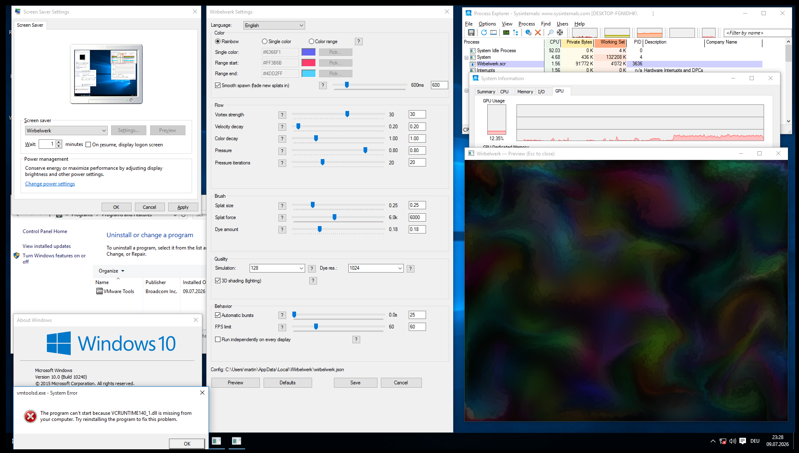

# Wirbelwerk Screensaver

A GPU-accelerated fluid simulation screensaver for Windows. Wirbelwerk (German for "vortex/simulation of swirling motion") renders a real-time, interactive fluid dynamics simulation — with colorful vortices, smooth splats, and customizable behavior — directly on your desktop.

Built on **OpenGL 3.3 Core** via **GLFW** and **GLAD**, the simulation runs a full Eulerian fluid solver (advection, pressure projection, vorticity confinement) entirely on the GPU using fragment shaders and floating-point framebuffers.

The following image shows the screensaver in action on an x64 virtual machine with a minimal version of Windows 10 (version 10240). The machine has 1 GB of RAM, one thread, and passed-through 3D acceleration based on an RTX 2070 Super. It also has VMware Tools and minimal resource usage. There are no Microsoft Visual C++ Redistributables installed.


---

## Table of Contents

- [Wirbelwerk Screensaver](#wirbelwerk-screensaver)
  - [Table of Contents](#table-of-contents)
  - [Features](#features)
  - [System Requirements](#system-requirements)
  - [Installation](#installation)
    - [Quick Install (Pre-built Binary)](#quick-install-pre-built-binary)
    - [Manual Installation](#manual-installation)
  - [Building from Source](#building-from-source)
    - [Prerequisites](#prerequisites)
    - [Dependencies](#dependencies)
    - [Build Steps](#build-steps)
      - [1. Install vcpkg (if not already installed)](#1-install-vcpkg-if-not-already-installed)
      - [2. Install dependencies](#2-install-dependencies)
      - [3. Open the solution](#3-open-the-solution)
      - [4. Integrate vcpkg with Visual Studio](#4-integrate-vcpkg-with-visual-studio)
      - [5. Build](#5-build)
      - [6. Locate the output](#6-locate-the-output)
      - [7. Rename to .scr](#7-rename-to-scr)
    - [Build Configuration](#build-configuration)
      - [Post-Build Step (Optional)](#post-build-step-optional)
  - [Usage](#usage)
    - [Command-Line Arguments](#command-line-arguments)
    - [Settings Dialog](#settings-dialog)
    - [Color Modes](#color-modes)
    - [Per-Monitor Mode](#per-monitor-mode)
  - [Configuration](#configuration)
    - [Config File Location](#config-file-location)
    - [All Settings](#all-settings)
  - [Project Structure](#project-structure)
  - [Technical Overview](#technical-overview)
    - [Fluid Simulation](#fluid-simulation)
    - [Shader Pipeline](#shader-pipeline)
    - [Smooth Spawning](#smooth-spawning)
  - [Troubleshooting](#troubleshooting)
    - ["WebGL is not available" (browser version)](#webgl-is-not-available-browser-version)
    - [Screensaver doesn't appear in the Control Panel list](#screensaver-doesnt-appear-in-the-control-panel-list)
    - [The screensaver window is black](#the-screensaver-window-is-black)
    - [The screensaver exits immediately when launched](#the-screensaver-exits-immediately-when-launched)
    - [Config file is not being saved](#config-file-is-not-being-saved)
  - [License](#license)

---

## Features

- **Real-time fluid simulation** — advection, pressure projection, and vorticity confinement on the GPU
- **Three color modes** — Rainbow (random HSV), Single (fixed color), or Range (gradient between two colors)
- **Per-monitor support** — each physical display runs its own independent simulation instance
- **Smooth splat spawning** — new bursts fade in gradually instead of appearing instantly
- **Fully configurable** — 20+ simulation parameters adjustable via the native settings dialog
- **Live preview** — test settings in a floating preview window before applying them
- **Bilingual UI** — English and German (switchable from the settings dialog)
- **Multi-monitor aware** — spans the entire virtual desktop, or runs one simulation per monitor
- **FPS limiting** — reduce GPU usage and power consumption
- **Low resource usage** — efficient GPU compute with configurable resolution

---

## System Requirements

| Component | Minimum | Recommended |
|-----------|---------|-------------|
| **OS** | Windows 10 64-bit | Windows 11 64-bit |
| **GPU** | OpenGL 3.3 capable GPU | OpenGL 4.x capable GPU |
| **RAM** | 256 MB | 512 MB+ |
| **Storage** | 10 MB | 10 MB |
| **Dependencies** | — | Visual C++ Redistributable 2022 |

> **Note:** The screensaver uses OpenGL 3.3 Core Profile with `GL_HALF_FLOAT` texture support. Most GPUs from 2010 and later are fully compatible.

---

## Installation

### Quick Install (Pre-built Binary)

1. Download the latest `Wirbelwerk.scr` from the [Releases](https://github.com/craeckor/Wirbelwerk-Screensaver/releases) page.
2. Right-click the `.scr` file and select **Install** (or copy it to `C:\Windows\System32\` manually).
3. Open **Windows Settings** → **Personalization** → **Lock screen** → **Screen saver settings**.
4. Select **Wirbelwerk** from the drop-down list.
5. Click **Settings** to customize the simulation to your liking.
6. Click **Preview** to test, then **OK** to save.

### Manual Installation

1. Copy `Wirbelwerk.scr` to `C:\Windows\System32\` (requires administrator privileges).
2. Open a Command Prompt as Administrator and run:
   ```
   rundll32.exe desk.cpl,InstallScreenSaver C:\Windows\System32\Wirbelwerk.scr
   ```
3. Configure via **Settings** → **Personalization** → **Lock screen** → **Screen saver settings**.

> **No administrator rights?** You can also place the `.scr` file anywhere on your system and run it directly. The screensaver will still appear in the drop-down list if copied to `System32`, but you can run it with `Wirbelwerk.scr /s` from any location.

---

## Building from Source

### Prerequisites

| Tool | Version | Purpose |
|------|---------|---------|
| **Visual Studio 2022** | 17.0+ (v143 toolset) | C++ compiler and build system |
| **CMake** (optional) | 3.20+ | Alternative build (not required for .slnx) |
| **vcpkg** | Latest | Package manager for dependencies |
| **Git** | Any | Cloning the repository |

### Dependencies

All dependencies are managed via **vcpkg** with static linking:

| Library | vcpkg Port | Purpose |
|---------|-----------|---------|
| **glfw3** | `glfw3` | Windowing, input, OpenGL context creation |
| **glad** | `glad` | OpenGL 3.3 Core loader |
| **nlohmann-json** | `nlohmann-json` | JSON config file parsing |

### Build Steps

#### 1. Install vcpkg (if not already installed)

```powershell
# Clone vcpkg (or use an existing installation)
git clone https://github.com/Microsoft/vcpkg.git
cd vcpkg
.\bootstrap-vcpkg.bat

# Add vcpkg to your PATH, or use the full path in step 2
```

#### 2. Install dependencies

```powershell
cd <project-root>
vcpkg install glfw3:x64-windows-static glad:x64-windows-static nlohmann-json:x64-windows-static
```

> **Note:** The project uses `VcpkgUseStatic=true` and `VcpkgUseMD=false` (static CRT linking).  
> The triplet `x64-windows-static` is required. For 32-bit builds, use `x86-windows-static`.

#### 3. Open the solution

Open `WirbelwerkScreensaver.slnx` in Visual Studio 2022.

#### 4. Integrate vcpkg with Visual Studio

Either:
- Run `vcpkg integrate install` (global integration), or
- Set the `VcpkgEnabled` property in the project settings, or
- Pass the vcpkg toolchain via `CMAKE_TOOLCHAIN_FILE` if using CMake

#### 5. Build

Select **Release** | **x64** configuration, then:

- **Visual Studio**: `Build` → `Build Solution` (Ctrl+Shift+B)
- **Command Line**:
  ```powershell
  msbuild WirbelwerkScreensaver.slnx /p:Configuration=Release /p:Platform=x64
  ```

#### 6. Locate the output

The built executable is at:
```
x64\Release\WirbelwerkScreensaver.exe
```

#### 7. Rename to .scr

For Windows to recognize it as a screensaver, rename the extension:

```powershell
copy x64\Release\WirbelwerkScreensaver.exe x64\Release\Wirbelwerk.scr
```

Or configure the project to do this automatically via a post-build step (see [Build Configuration](#build-configuration)).

### Build Configuration

The Visual Studio project supports four configurations:

| Configuration | CRT | Optimization | Debug Info |
|--------------|-----|-------------|------------|
| **Debug** x64 | `/MTd` (static debug) | None | Full PDB |
| **Release** x64 | `/MT` (static release) | Full (/LTCG /GL) | Yes (stripped) |
| **Debug** Win32 | `/MTd` (static debug) | None | Full PDB |
| **Release** Win32 | `/MT` (static release) | Full (/LTCG /GL) | Yes (stripped) |

Key project settings:
- **Subsystem**: Windows (`/SUBSYSTEM:WINDOWS`)
- **Entry point**: `mainCRTStartup` (console-free Windows app)
- **C++ Standard**: C++20 (`/std:c++20`)
- **Character set**: Unicode
- **Manifest**: Per-Monitor-V2 DPI awareness via `app.manifest`
- **Segment heap**: Enabled (Release only, via `/ENABLESEGMENTHEAP`)

#### Post-Build Step (Optional)

To automatically copy the built `.exe` as `.scr` to `System32`, add this as a post-build event in Visual Studio:

```
copy "$(TargetPath)" "$(TargetDir)Wirbelwerk.scr"
copy "$(TargetPath)" "%SystemRoot%\System32\Wirbelwerk.scr"
```

---

## Usage

### Command-Line Arguments

Wirbelwerk follows the standard Win32 screensaver command-line contract:

| Argument | Description |
|----------|-------------|
| *(no args)* | Opens the settings dialog (default Explorer double-click behavior) |
| `/s` or `-s` | Launches full-screen screensaver mode |
| `/c` or `-c` | Opens the settings/configuration dialog |
| `/c:<hwnd>` | Opens the settings dialog owned by a specific window handle |
| `/p <hwnd>` or `-p <hwnd>` | Renders a live preview embedded in the given window handle (used by the Control Panel preview thumbnail) |
| `/a` or `-a` | Legacy password prompt — accepted, falls through to full-screen mode |
| `/d` | Debug mode (opens a windowed, resizable simulation for testing) |

> **Note:** Both `/` and `-` prefixes are accepted. All switches are case-insensitive.  
> For the `/p` switch, the window handle can be specified as a decimal number, either space-separated (`/p 123456`) or colon-separated (`/p:123456`).

### Settings Dialog

The settings dialog is a native Win32 dialog with 20+ controls organized into groups:

- **Color** — Color mode selection, hex color pickers, smooth spawn toggle & duration
- **Flow** — Vortex strength, velocity decay, color decay, pressure, pressure iterations
- **Brush** — Splat size, splat force, dye amount
- **Quality** — Simulation resolution, dye resolution, 3D shading toggle
- **Behavior** — Automatic bursts, burst interval, FPS limit, per-monitor mode

Each slider has a corresponding manual edit field where you can type exact numeric values.  
Click the **?** button next to any control for a detailed explanation in the current language.

### Color Modes

| Mode | Description |
|------|-------------|
| **Rainbow** | Each splat gets a random HSV hue. Classic colorful look. |
| **Single color** | All splats use the same fixed color (default: indigo `#6366F1`). |
| **Color range** | Each splat picks a random color interpolated between two endpoints (default: `#FF3B6B` → `#4DD2FF`). |

### Per-Monitor Mode

When enabled (`PER_MONITOR: true`), each physical display runs its own independent fluid simulation instance. This means:
- Splats and bursts are not synchronized across monitors
- Each display has independent color state and fluid motion
- Best for multi-monitor setups where you want variety

When disabled (default), one simulation spans the entire virtual desktop.

---

## Configuration

### Config File Location

The screensaver stores its configuration in:

```
%LOCALAPPDATA%\Wirbelwerk\wirbelwerk.json
```

Example: `C:\Users\YourName\AppData\Local\Wirbelwerk\wirbelwerk.json`

This file is always user-writable and never requires administrator privileges. On first run, the screensaver will also check for a legacy `wirbelwerk.json` next to the executable (e.g., in `C:\Windows\System32\`) and migrate it to the AppData location automatically.

### All Settings

| JSON Key | Type | Default | Description |
|----------|------|---------|-------------|
| `SIM_RESOLUTION` | int | `128` | Internal grid size for velocity/pressure calculations. Must be a multiple of 8. |
| `DYE_RESOLUTION` | int | `1024` | Texture resolution for the visible color buffer. |
| `VELOCITY_DISSIPATION` | float | `0.2` | How quickly the fluid motion slows down. Higher = calmer. |
| `DENSITY_DISSIPATION` | float | `1.0` | How quickly the dye/color fades. Higher = faster fade. |
| `PRESSURE` | float | `0.8` | Fluid incompressibility. Higher = more rigid. |
| `PRESSURE_ITERATIONS` | int | `20` | Solver iterations per frame. Higher = more accurate, slower. |
| `CURL` | float | `30.0` | Vortex/rotational force. Higher = more turbulence. |
| `SPLAT_RADIUS` | float | `0.25` | Size of each ink splat. |
| `SPLAT_FORCE` | float | `6000.0` | Momentum transferred by each splat. |
| `DYE_AMOUNT` | float | `0.18` | Color intensity deposited per splat. |
| `SHADING` | bool | `true` | Pseudo-3D lighting effect on the fluid surface. |
| `COLOR_MODE` | string | `"RAINBOW"` | One of `RAINBOW`, `SINGLE`, `RANGE`. |
| `COLOR_SINGLE` | string | `"#6366F1"` | Hex color used in SINGLE mode. |
| `COLOR_RANGE_START` | string | `"#FF3B6B"` | Hex start color for RANGE mode. |
| `COLOR_RANGE_END` | string | `"#4DD2FF"` | Hex end color for RANGE mode. |
| `SMOOTH_SPAWN` | bool | `true` | Fade new splats in gradually. |
| `SMOOTH_SPAWN_MS` | float | `600.0` | Duration of smooth spawn fade-in (ms). |
| `AUTO_BURST` | bool | `true` | Periodically spawn new splats automatically. |
| `AUTO_INTERVAL_MS` | float | `2600.0` | Interval between automatic bursts (ms). |
| `FPS_LIMIT` | int | `60` | Maximum frames per second. `0` = uncapped. |
| `PER_MONITOR` | bool | `false` | Independent simulation per physical display. |
| `LANGUAGE` | string | `"ENGLISH"` | UI language: `"ENGLISH"` or `"GERMAN"`. |

---

## Project Structure

```
WirbelwerkScreensaver/
├── WirbelwerkScreensaver.slnx          # Visual Studio solution file
├── README.md                           # This file
├── .gitignore                          # Git ignore rules
│
├── WirbelwerkScreensaver/              # Main project directory
│   ├── main.cpp                        # Entry point, arg parsing, full-screen runtime
│   ├── Simulation.cpp / .h             # GPU fluid simulation (Eulerian solver)
│   ├── Config.cpp / .h                 # Config file I/O, color helpers
│   ├── ConfigDialog.cpp / .h           # Native Win32 settings dialog
│   ├── Preview.cpp / .h                # Embedded & floating preview windows
│   ├── Monitors.cpp / .h               # Display monitor enumeration
│   ├── resource.h                      # Resource ID definitions
│   ├── WirbelwerkScreensaver.rc        # Dialog layout & string resources
│   ├── app.manifest                    # DPI awareness & common controls manifest
│   │
│   ├── WirbelwerkScreensaver.vcxproj   # Visual Studio project file
│   ├── WirbelwerkScreensaver.vcxproj.filters
│   └── WirbelwerkScreensaver.vcxproj.user
│
├── x64/                                # Build output directory
│   └── Release/
│       └── WirbelwerkScreensaver.exe
│
└── source/                             # Reference documentation & design files
    ├── docs-1.md                       # Win32 screensaver API documentation
    ├── docs-2.md                       # Screensaver sample documentation
    ├── docs-3.txt                      # .scr command-line reference
    ├── source-code.html                # Web-based fluid simulation (HTML/JS/WebGL)
    ├── source-code-2.html              # Refined web simulation variant
    └── wirbelwerk.json                 # Default configuration template
```

---

## Technical Overview

### Fluid Simulation

The core simulation is a **Eulerian fluid solver** implemented entirely on the GPU via OpenGL fragment shaders. Each frame consists of these steps:

1. **Curl computation** — Calculate vorticity from the velocity field
2. **Vorticity confinement** — Apply rotational force to preserve turbulent detail
3. **Divergence computation** — Measure mass conservation error
4. **Pressure solve** — Iterative Gauss-Seidel solver (Jacobi iterations) to find the pressure field that makes the flow divergence-free
5. **Gradient subtraction** — Subtract the pressure gradient from the velocity field
6. **Advection** — Advect both velocity and dye through the flow field using a semi-Lagrangian scheme

All intermediate quantities are stored in 16-bit floating-point framebuffers (`GL_RGBA16F`, `GL_RG16F`, `GL_R16F`).

### Shader Pipeline

| Shader | Input | Output | Purpose |
|--------|-------|--------|---------|
| `curl` | Velocity | Curl (R16F) | Vorticity magnitude |
| `vorticity` | Velocity + Curl | Velocity | Apply vorticity confinement |
| `divergence` | Velocity | Divergence (R16F) | Mass conservation error |
| `pressure` | Pressure + Divergence | Pressure | Jacobi iteration |
| `gradientSubtract` | Pressure + Velocity | Velocity | Make flow divergence-free |
| `advection` | Velocity + Source | Velocity/Dye | Semi-Lagrangian advection |
| `display` | Dye | Screen | Tonemapping + optional 3D shading |
| `splat` | Target | Target | Inject velocity/dye impulse |

### Smooth Spawning

When smooth spawning is enabled (`SMOOTH_SPAWN: true`), new splats are not injected instantly. Instead, each splat is queued with a duration (default 600 ms) and injected incrementally over that period using an ease-out ramp. This creates a natural, organic feel — bursts appear to bloom rather than pop in.

The pending splat queue has a maximum capacity of 256 entries to prevent unbounded memory growth.

---

## Troubleshooting

### "WebGL is not available" (browser version)
The web-based prototypes in `source/` require WebGL. Use a modern browser (Chrome, Firefox, Edge).

### Screensaver doesn't appear in the Control Panel list
- Ensure the file has the `.scr` extension, not `.exe`.
- Copy it to `C:\Windows\System32\` and restart the Control Panel.
- The screensaver name string is embedded in the resource file (ordinal 1).

### The screensaver window is black
- Your GPU may not support `GL_HALF_FLOAT` or `GL_RGBA16F` framebuffer formats.
- Try lowering the simulation or dye resolution.
- Update your GPU drivers.

### The screensaver exits immediately when launched
- Check that the display is not in a locked/screensaver-protected state.
- Verify you have a functioning OpenGL 3.3 driver.
- Run from a command prompt to see any error output.

### Config file is not being saved
- Check that `%LOCALAPPDATA%\Wirbelwerk\` is writable.
- The config file is never written to the executable's directory (which may be in an admin-protected `System32` folder).

---

## License

This project is provided as-is. See the `LICENSE` file for details.

---

*Wirbelwerk — Fluid simulation for your desktop.*
